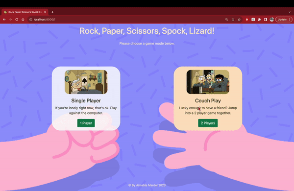

# Rock Paper Scissors Spock Lizard

### >> [Play the game here!](https://rps-v1--mardeldev.repl.co/) <<

# How to play

---

There are two game modes: **single player** and **multiplayer.**

### Single Player:


For this game mode, you will be playing against the computer.

- Choose **single player** on the home page.
- Enter your name and choose how many rounds you would like to play.
- Click 'Play!' and you will be taken into the first round.
- You will choose your weapon first, and then the computer will choose its weapon randomly.
- After the number of rounds you chose have been played, the winner will then be displayed, along with the amount of points received each.

### Multiplayer:



For this game mode, you will be playing against someone else in the same room as you.

- Choose **multiplayer** on the home page.
- Enter the names of the players, and choose how many rounds you would like to play.
- Click 'Play!' and you will be taken into the first round.


- The name of the player whose turn it is will be displayed on each round.
- Take turns to choose a weapon and you will see the results of each round.
- After the number of rounds you chose have been played, the winner will then be displayed, along with the amount of points received each.
- The winner will be declared when the number of rounds chosen have been played. You will also see the points of each player.


### Rules:
You will be able to remind yourself of the rules at each round as you are choosing your weapon. Stay informed!


---
# Installation
You can play instantly using the link at the top of this README, but if you would like for your experience to be smoother and play locally then follow these instructions:

- Clone this repo
- Navigate to:
```
rock-paper-scissors-challenge
```
 
- Install the project dependencies with the command:
```
npm i
```
- Run the tests using the command:
```
npm test
```
- Run the app:
```
npm start
```
- In your browser, go to the address `http://localhost:8000/`
- Enjoy your game!